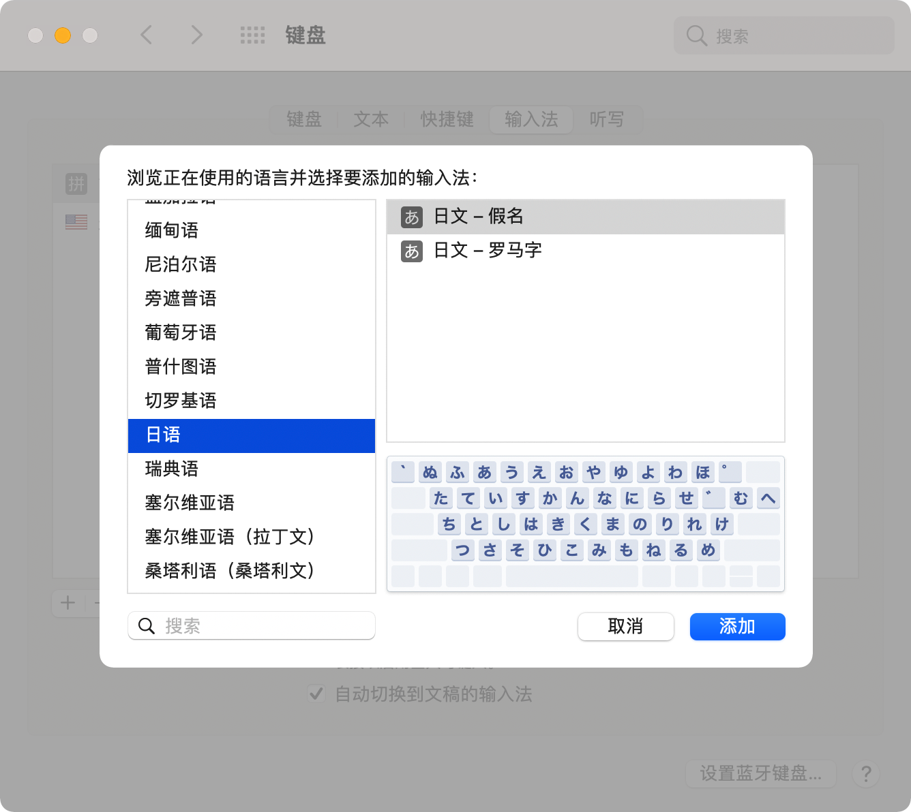
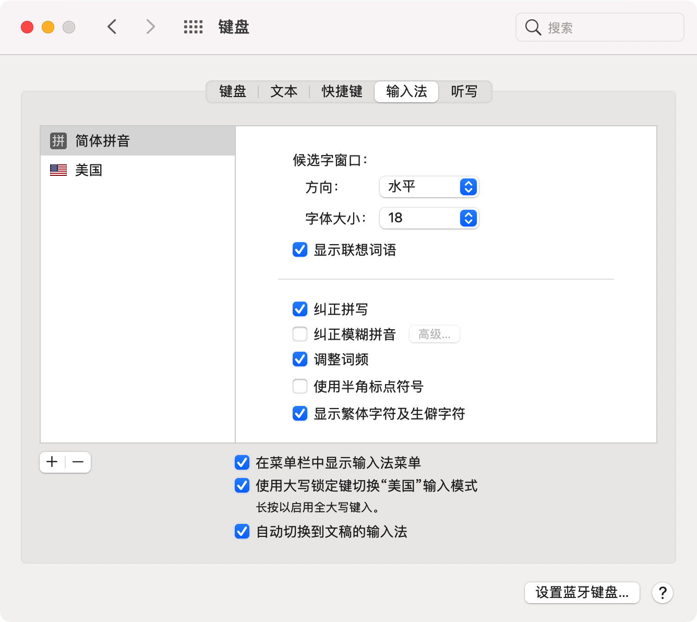
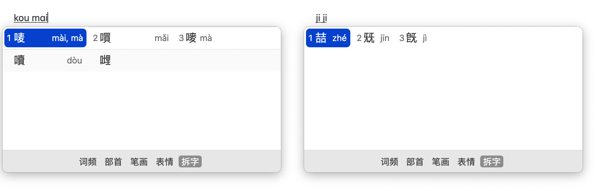
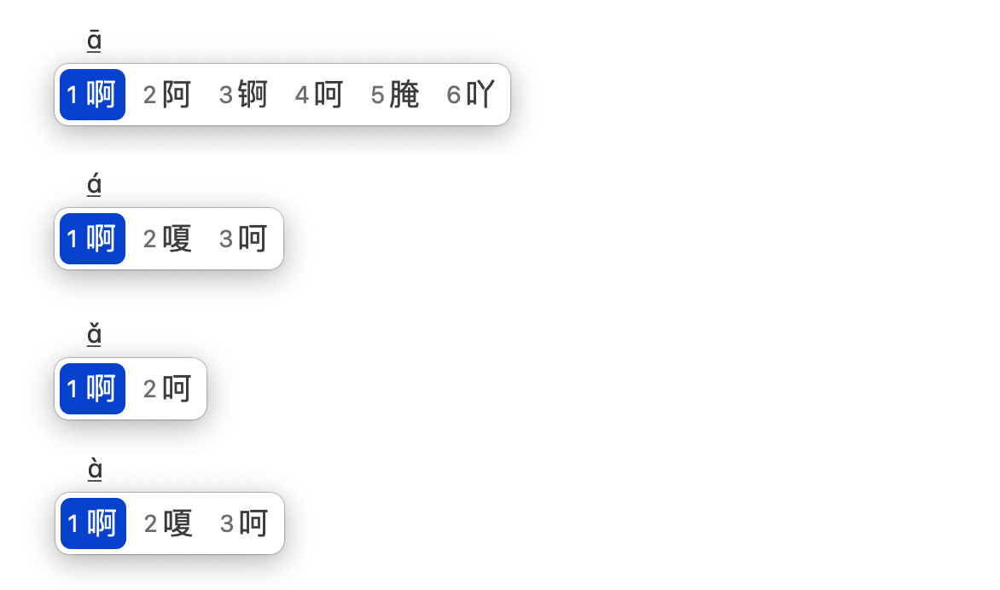
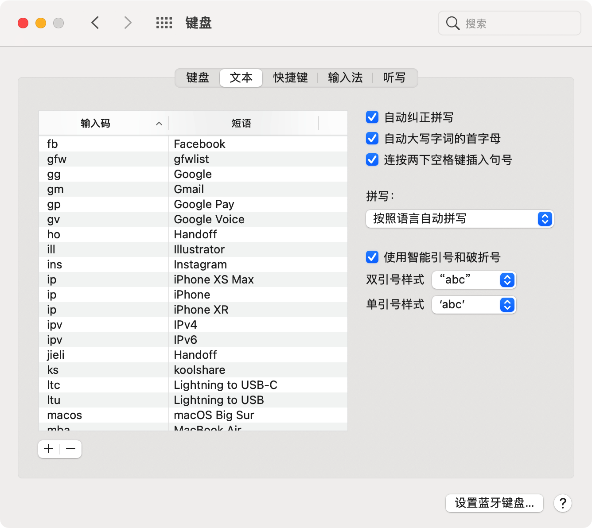
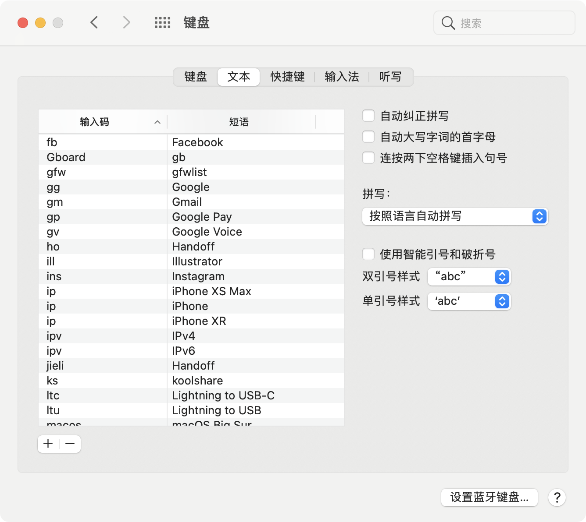

# Mac 自带输入法，真的很难用吗？
很多人不喜欢 Mac / iOS 自带输入法，认为词库少且会丢失，词频混乱，大小写 / 切换中英文按键和自己的习惯不符。

也有一部分人喜欢，认为够清爽，流畅度高，个人隐私得到保障。

今天来详细介绍下自带输入法，看看它到底是好是坏。

---

### 目录

* [切换输入法](#一切换输入法)
* [添加其他语言输入法](#二添加其他语言输入法)
* [显示生僻字](#三显示生僻字)
* [拆字输入](#四拆字输入)
* [声调输入](#五声调输入)
* [中英文混输](#六中英文混输)
* [文本替换](#七文本替换)

---

### 一、切换输入法

快捷键 **Command-空格键**切换输入法，也有人设置为 **Control-空格键**。

按住 Command 键不松，再按空格键桌面中央会显示所有输入法，轮流切换。

---

### 二、添加其他语言输入法

系统偏好设置 > 键盘 > 输入法 > 点击左侧 `+` 添加所需要的输入法。

 

---

### 三、显示生僻字

很多人发现平时打字，候选词找不到某些字，例如【唛】（读音 mài）默认是不显示的。

解决方法：在输入法简体拼音里右侧往下拉，会看到【显示繁体字符及生僻字符】。

---

### 四、拆字输入

我们遇到不认识的字时，可以选择把字拆解，例如，【喆】，只需要键入 `jiji`，然后按下 **Shift-空格键**，候选字会显示 `喆`、`兓` 和 `旣”`。

---

### 五、声调输入

按 `tab` 键可输出声调，方便快速找到候选词，再按 `回车键` 输出声调字母。

---

### 六、中英文混输

* 按 `Shift` 键输出大写英文
* 按 `Option` 键输出数字

例如，南京路A座909室，输入方法：`nanjinglu`  `Shift a` `zuo` `Option 909` `shi`

---

### 七、文本替换

1. 系统偏好设置 > 键盘 > 文本。
2. 点按左下方的 `+` ，在 “输入码” 列中输入要替换的文本（如 *gg*），并且在“短语”列中键入其替换项（如 *Google*）。

【注】同一 Apple ID 下的设备，文本替换支持同步。

